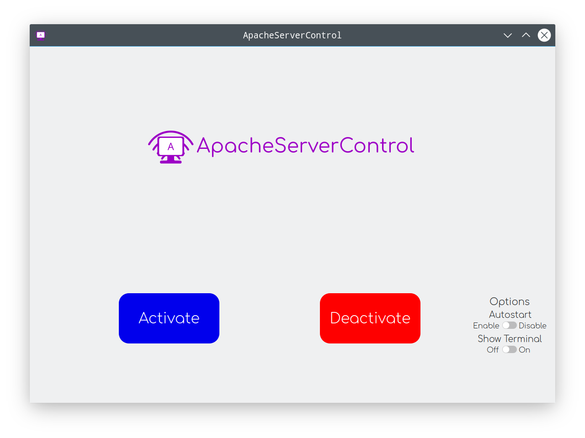
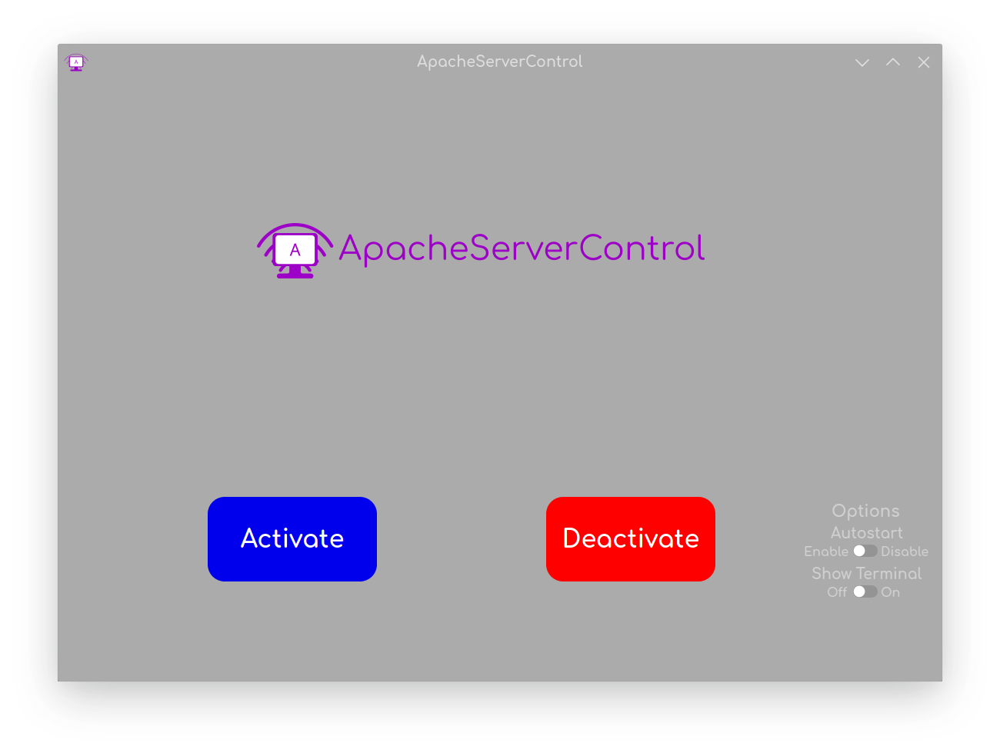
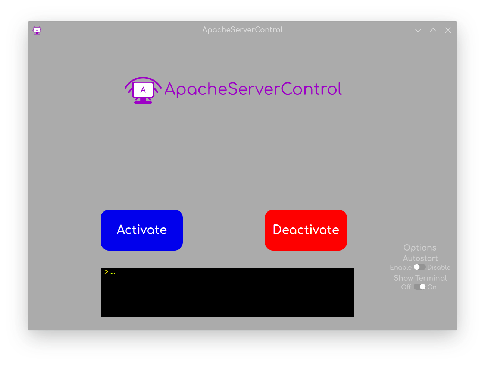

# apache-server-control-app
A new blazing fast app to help you to control _Apache Server_ graphically on _Linux_.

Apache Server Control Themed (ThemeSet: Akava-Kv, ThemeEngine: _Kvantum_, DE: _Kde_)

Apache Server Control with Mini Terminal Open (ThemeSet: Akava-Kv, ThemeEngine: _Kvantum_, De: _Kde_)

This app was created to help webdevelopers to increase their production, and to help being faster to control Apache Server.
It's strongly recommended to already have some knowledge about Apache Server before using this program. \
If you get any error, the mini terminal in-app won't show what is happening, to see better what is going on and to be able to see the logs from other programs, run in terminal, by typing `apache-server-control`. \
This program doesn't pre-install its dependencies yet. The dependencies are _python3_, _PyQt5_, _apache/httpd_, and _systemd_.
For now there isn't an automated installer for this program, however, following the *installation-list.txt* file you can install it to be system-wide. \
You also have an option to run a headless mode by typing in terminal `apache-ctrl.sh` with one of the flags, that are `-i`, `-t`, `-e`, `-d` and `-h` for help.
You can create a *.desktop* file, while it doesn't have an installer to create one.
